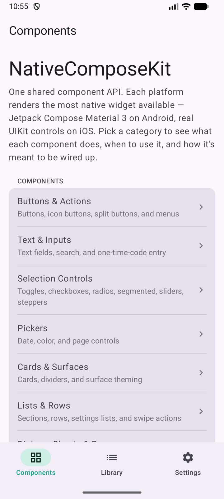
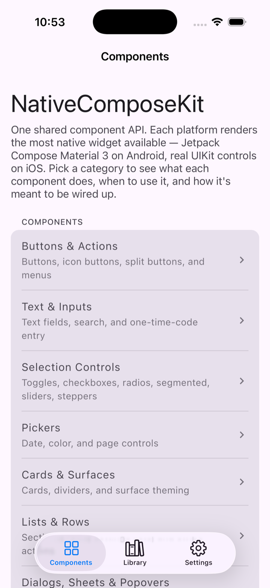
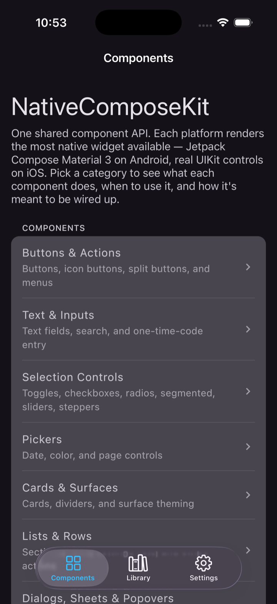

# NativeComposeKit

[](https://central.sonatype.com/artifact/io.github.apdelrahman1911/nativecomposekit)
[](https://github.com/ukkkera/NativeComposeKit/actions/workflows/ci.yml)
[](LICENSE)


A Compose Multiplatform UI kit for Android and iOS. You call one shared component API from
`commonMain`, and each platform renders with the most native widget available: Jetpack Compose
Material 3 on Android, real UIKit controls on iOS. A `NativeToggle` is a `Switch` on Android and a
`UISwitch` on iOS; a `NativeSegmentedControl` is a `UISegmentedControl` on iOS. The shared code stays
the same — the rendering doesn't pretend.

<p align="center">
  
  
  
</p>
<p align="center"><sub>The same <code>commonMain</code> screen — Material&nbsp;3 on Android&ensp;·&ensp;real UIKit chrome and controls on iOS, light and dark.</sub></p>

## The idea

One shared Compose/KMP API → the most-native renderer per platform.

Cross-platform UI usually means one of two things: draw everything yourself so it looks identical
everywhere (and slightly off on every platform), or maintain two native codebases. This kit takes a
third path. Each component is a single `@Composable` in `commonMain` that resolves its styling from
the theme and then hands off to a platform renderer through `expect`/`actual`:

```
NativeButton(…)                       // commonMain: the shared API + theme resolution
  └─ expect PlatformNativeButton(style, …)
       ├─ androidMain → Material 3 Button                 (NativeButton.android.kt)
       └─ iosMain     → UIButton via Compose UIKitView    (NativeButton.ios.kt)
```

Android users get Material 3 with its motion, ripple, and dynamic color. iOS users get the system
controls they already know — correct sizing, haptics, context menus, and accessibility — instead of
look-alikes. A handful of components have no native counterpart on one side (there's no UIKit radio
button or checkbox); those are documented exceptions that stay Compose-drawn on both platforms.

## Platforms

| Target | Renderer |
|---|---|
| Android | Jetpack Compose Material 3 |
| iOS (arm64, simulator-arm64) | UIKit controls hosted in Compose via `UIKitView` |
| Shared | Kotlin Multiplatform + Compose Multiplatform (`commonMain`) |

iOS ships `iosArm64` and `iosSimulatorArm64`. `iosX64` is intentionally dropped — Compose
Multiplatform 1.11 no longer supports the Apple x86_64 target.

## Toolchain

| Tool | Version |
|---|---|
| Kotlin | 2.3.21 |
| Compose Multiplatform | 1.11.0 |
| Android Gradle Plugin | 8.13.0 |
| Gradle | 8.13 |
| compileSdk / targetSdk | 36 |
| minSdk | 26 |
| iOS deployment target | 15.0 |

These are pinned in `gradle/libs.versions.toml`. The library module (`:nativecomposekit`) depends only on
Compose artifacts — no third-party runtime dependencies.

## Modules

```
:nativecomposekit     the UI kit (published surface; ABI-locked with binary-compatibility-validator)
:composeApp   the sample catalog app that exercises every component on both platforms
iosApp        native iOS host: the UIKit chrome shell (UITabBarController + per-tab UINavigationControllers) in a SwiftUI app entry
```

## Setup

Releases publish to **Maven Central** as `io.github.apdelrahman1911:nativecomposekit`
(see [docs/publishing.md](docs/publishing.md) for the release process):

```kotlin
// build.gradle.kts (commonMain)
kotlin {
    sourceSets {
        commonMain.dependencies {
            implementation("io.github.apdelrahman1911:nativecomposekit:0.2.1")
        }
    }
}
```

`mavenCentral()` in your repositories is all that's needed. To work against a local checkout instead
(unreleased changes), use one of:

**A — composite build** (clone next to your project; Gradle substitutes the coordinates with the local
module automatically):

```kotlin
// settings.gradle.kts
includeBuild("../NativeComposeKit")
```

**B — local Maven repository:**

```bash
cd NativeComposeKit && ./gradlew :nativecomposekit:publishToMavenLocal
```

```kotlin
// settings.gradle.kts
dependencyResolutionManagement { repositories { mavenLocal(); google(); mavenCentral() } }
```

Both local flavors resolve the same dependency line shown above.

## Usage

Every component is a `Native*` composable from `io.github.apdelrahman1911.nativecomposekit.components`. Wrap
your UI in `NativeKitTheme` once, then call components directly:

```kotlin
import io.github.apdelrahman1911.nativecomposekit.components.*
import io.github.apdelrahman1911.nativecomposekit.theme.NativeKitTheme

@Composable
fun SignInForm(onSignIn: (String) -> Unit) {
    var email by remember { mutableStateOf("") }

    NativeScaffold(topBar = { NativeTopBar(title = "Sign in") }) { padding ->
        Column(Modifier.padding(padding).padding(16.dp)) {
            NativeText("Welcome back", style = NativeTextStyle.Title)
            NativeTextField(
                value = email,
                onValueChange = { email = it },
                label = "Email",
                placeholder = "you@example.com",
            )
            NativeButton(
                text = "Continue",
                onClick = { onSignIn(email) },
                fullWidth = true,
            )
        }
    }
}
```

On Android this renders Material 3 controls; on iOS the button, text, and field are real `UIButton`,
`UILabel`, and `UITextField` instances.

## Theming

`NativeKitTheme` is the single source of styling — Material's `ColorScheme`/`Typography`/`Shapes` plus a
small set of design tokens (spacing, radii, status colors). There is no separate token file.
Components read their defaults from the theme and expose per-call overrides as typed parameters.

```kotlin
NativeKitTheme(
    darkTheme = isSystemInDarkTheme(),
    // override any slice; defaults cover the common case
    // lightColors = myLightScheme,
    // tokens = NativeTokens(spacingMd = 12.dp),
) {
    App()
}
```

Switching `darkTheme` updates both the Compose Material controls and the UIKit controls — the iOS
renderers set `overrideUserInterfaceStyle` from the luminance of the surface they sit on, so they
read correctly in light and dark on any background. See
[`docs/design-system-rules.md`](docs/design-system-rules.md) for the rules a component follows.

Strings the kit renders on its own (retry buttons, alert fallbacks, accessibility labels) come from a
localizable table with English defaults — pass a translated `NativeStrings` the same way:
`NativeKitTheme(strings = NativeStrings(retry = "…", dismiss = "…"))`.

## Project structure

A typical app using the kit looks like:

```
app/
  commonMain/
    App.kt              wraps everything in NativeKitTheme
    screens/            your screens, built from Native* components
  androidMain/          MainActivity → App()
  iosMain/              MainViewController → App()
iosApp/                 native iOS host (chrome shell + ComposeUIViewController)
```

Keep `NativeKitTheme` at the root so every component resolves the same theme. Apps that use the app-wide
appearance switching or the native iOS shell should wrap each composition root in **`NativeAppearanceScope`**
instead of calling `NativeKitTheme` directly — the scope forwards every theming parameter AND drives the
process-wide dark/RTL overrides, the reduce-motion capability, and the iOS window/shell background
(`NativeAppearance.setDark` has no effect on compositions outside the scope). Build screens out of
`Native*` components rather than reaching for raw Material or UIKit — that's what keeps a screen
native on both platforms from one code path. The `:composeApp` module in this repo is a working
example.

## Usage notes

A few things worth knowing up front; they save the most common surprises.

- **Give content-sized UIKit controls an explicit width.** Some iOS controls size to their content
  through `UIKitView` interop and collapse to zero width without a width constraint.
  - `NativeSegmentedControl` usually wants `Modifier.fillMaxWidth()` — segmented controls normally
    span the available width.
  - `NativePageControl` inside a `Row` wants `Modifier.weight(1f)` (or another explicit width) so its
    dots have room. Fixed-size controls like `NativeToggle` and `NativeStepper` don't need this.
- **Sheets:** use `NativeSheet` for sheet-style and mobile content. On iOS it's a real
  `UISheetPresentationController` with detents and a grab handle.
- **Popovers:** `NativePopover` adapts to the device. On iPhone / compact width it uses a lightweight
  Compose popover (a full-screen UIKit popover on a phone is the wrong UX); on iPad / regular width
  it uses a native `UIPopoverPresentationController` anchored to your `anchor`.
- **Alerts:** for plain text-and-buttons alerts use `feedback.alert` — it's a real `UIAlertController`
  on iOS. Reach for `NativeDialog` only when the modal needs custom Compose content (a form, a list,
  an image).
- **OTP entry:** for native iOS SMS autofill use `NativeTextField(contentType = OneTimeCode)`.
  `NativeOtpField` is the branded segmented-cell visual and does not provide system autofill.
- **Settings switches:** prefer `NativeToggle` over a checkbox on iOS — a switch is the platform
  idiom. `NativeCheckbox` exists for the cases that genuinely need a checkbox.

## iOS interop limitations

The kit hosts UIKit controls inside Compose via `UIKitView`. A few Compose Multiplatform 1.11
behaviors in this area are upstream and have no clean workaround through public API. The kit picks
the least-bad trade-off and documents it; details and upstream issue links are in
[`docs/interop-notes.md`](docs/interop-notes.md).

- **Scrolling:** a `UIKitView` inside a Compose scroll can either clip its edge (cut-out placement)
  or drift slightly during the gesture (overlay placement). Leaf controls use overlay — the drift is
  subtler than a clipped edge and settles the moment scrolling stops.
- **Menu buttons:** a `UIButton` with a `UIMenu` can drift from its row after its menu has been
  opened once, because the menu leaves a transform on a view the kit can't reach. The native menu is
  kept; the post-open drift is the accepted cost.
- **Dialogs/popups:** a freshly opened Compose `Dialog`/`Popup` can flash the host backdrop for one
  frame where a `UIKitView` will appear. `NativeDialog` avoids this by drawing its text through
  Compose and compositing its controls as an overlay, so the card's own pixels show from the first
  frame.

## Components

Full reference with every parameter, both renderers, and examples is in
[`docs/components/`](docs/components/README.md).

- **Text & input** — [`NativeText`](docs/components/text-and-input.md),
  [`NativeTextField`](docs/components/text-and-input.md),
  [`NativeSearchBar`](docs/components/text-and-input.md),
  [`NativeOtpField`](docs/components/text-and-input.md)
- **Buttons** — [`NativeButton`](docs/components/buttons.md),
  [`NativeIconButton`](docs/components/buttons.md),
  [`NativeSplitButton`](docs/components/buttons.md), `NativeMenu`
- **Selection & sliders** — [`NativeToggle`](docs/components/selection-and-sliders.md),
  [`NativeCheckbox`](docs/components/selection-and-sliders.md),
  [`NativeRadioGroup`](docs/components/selection-and-sliders.md),
  [`NativeSegmentedControl`](docs/components/selection-and-sliders.md),
  [`NativeSlider`](docs/components/selection-and-sliders.md),
  [`NativeStepper`](docs/components/selection-and-sliders.md),
  [`NativeRating`](docs/components/selection-and-sliders.md)
- **Pickers & pagination** — [`NativeDatePicker`](docs/components/pickers.md),
  [`NativeColorWell`](docs/components/pickers.md),
  [`NativePageControl`](docs/components/pickers.md),
  [`NativePager`](docs/components/pickers.md),
  [load-more helpers (`NativeLoadMoreEffect`, `nativePaginationFooter`)](docs/components/pickers.md)
- **Overlays** — [`NativeSheet`](docs/components/overlays.md),
  [`NativePopover`](docs/components/overlays.md),
  [`NativeDialog`](docs/components/overlays.md),
  [`rememberNativeShare`](docs/components/overlays.md)
- **Feedback & progress** — [`NativeProgressIndicator`](docs/components/feedback.md), alert /
  confirmation sheet / snackbar / toast / banner / inline status ([`feedback`](docs/components/feedback.md))
- **Layout** — [`NativeCard`](docs/components/layout.md),
  [`NativeScaffold`](docs/components/layout.md), [`NativeTopBar`](docs/components/layout.md),
  [`NativeListSection`](docs/components/layout.md), [`NativeListItem`](docs/components/layout.md),
  [`NativeDivider`](docs/components/layout.md)
- **Display & state** — [`NativeContentState`](docs/components/display-and-state.md),
  [`NativeSkeleton`](docs/components/display-and-state.md),
  [`NativeEmptyState`](docs/components/display-and-state.md),
  [`NativePullRefresh`](docs/components/display-and-state.md),
  [`NativeBadge`](docs/components/display-and-state.md),
  [`NativeAvatar`](docs/components/display-and-state.md),
  [`NativeChip`](docs/components/display-and-state.md)
- **Accessibility & focus** — [`nativeDismissKeyboardOnTap`, `nativeHeading`, `nativeAutoFocus`, focus handles / order / group](docs/components/accessibility.md),
  [`nativeImePadding`](docs/components/text-and-input.md)

## Documentation

- [Components reference](docs/components/README.md) — every component, parameter, and example
- [Architecture](docs/architecture.md) — how the shared API resolves to platform renderers
- [Design-system rules](docs/design-system-rules.md) — what a component must do to belong
- [Navigation](docs/navigation.md) — bring your own navigation; the kit's nav-agnostic native chrome contract
- [iOS native chrome](docs/native-chrome.md) — the shell's bars, safe-area/inset contract, and scroll-under-glass
- [iOS interop notes](docs/interop-notes.md) — UIKit interop limitations and trade-offs

## Building

```bash
# Android
./gradlew :composeApp:assembleDebug
./gradlew :composeApp:installDebug        # to a running emulator/device

# iOS (Kotlin side — fast check before opening Xcode)
./gradlew :composeApp:compileKotlinIosSimulatorArm64

# iOS app
cd iosApp && xcodegen generate && open iosApp.xcodeproj
```

### Tests and checks

```bash
./gradlew :nativecomposekit:apiCheck              # fail if the public ABI changed without an apiDump
./gradlew :nativecomposekit:testDebugUnitTest     # unit + Robolectric Compose tests (no emulator)
./gradlew :composeApp:testDebugUnitTest
./gradlew check                           # everything
```

The library's public API is locked with
[binary-compatibility-validator](https://github.com/Kotlin/binary-compatibility-validator). After an
intentional API change, regenerate the baseline with `./gradlew :nativecomposekit:apiDump` and commit the
updated files under `nativecomposekit/api/`.

## Contributing

Contributions are welcome. Before opening a pull request:

- Read [`docs/design-system-rules.md`](docs/design-system-rules.md) — a new component must resolve
  its style from the theme, render natively per platform (or be a documented exception), and add real
  design-system value rather than wrap a library.
- Keep `:nativecomposekit` free of third-party runtime dependencies.
- Run `./gradlew check` and, for any public API change, `:nativecomposekit:apiDump`.
- Add the component to the sample catalog so it's exercised on both platforms.

## Development notes

- **Naming.** The Kotlin package is `io.github.apdelrahman1911.nativecomposekit`, the Android
  namespace is `io.github.apdelrahman1911.nativecomposekit.kit`, and the public components use the
  `Native*` prefix. The Gradle module is still named `:nativecomposekit` — an internal build name, not the
  published group, so there's no need to churn it.
- **Publishing.** Releases go to Maven Central via the Central Portal — coordinates, POM, sources +
  javadoc (Dokka) jars, gated signing, and the upload tasks are wired; [docs/publishing.md](docs/publishing.md)
  is the runbook (incl. the owner-side account/GPG steps). Versions are tagged `v<version>` and recorded
  in [CHANGELOG.md](CHANGELOG.md).

## License

NativeComposeKit is released under the [Apache License 2.0](LICENSE).
